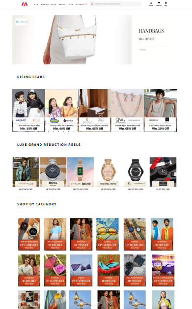
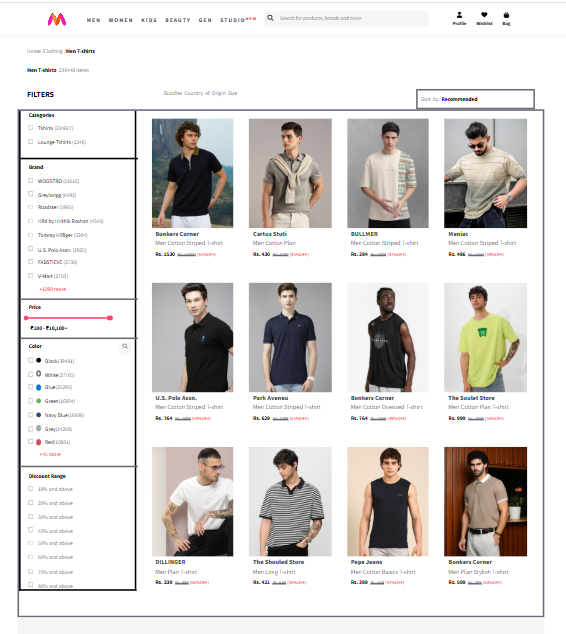
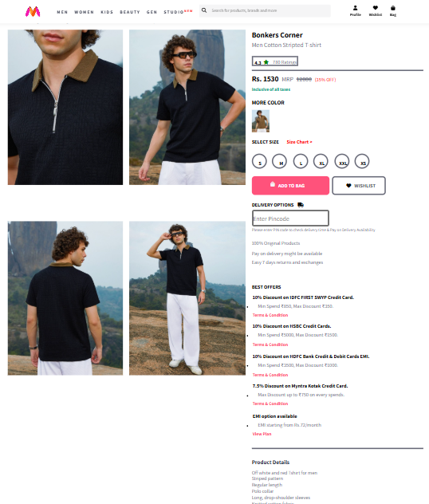

# Myntra Clone

A responsive Myntra-inspired e-commerce website clone built using HTML, CSS, and JavaScript.

## 🚀 Live Demo
(Add your live website link here)

---

## 📸 Screenshots

### Home Page

### T-Shirt Collection Page

### Product Details Page

---

## 🛠️ Technologies Used
- HTML5
- CSS3
- JavaScript

---

## ✨ Features
- Responsive Design
- Modern E-Commerce UI
- Product Listings
- Navigation Bar
- Banner Section
- Hover Effects
- Mobile-Friendly Layout

---

## 📂 Project Purpose
This project was created for frontend web development practice and to improve UI design and responsive website skills.

---

## 👨‍💻 Author
Rohit Sahu
